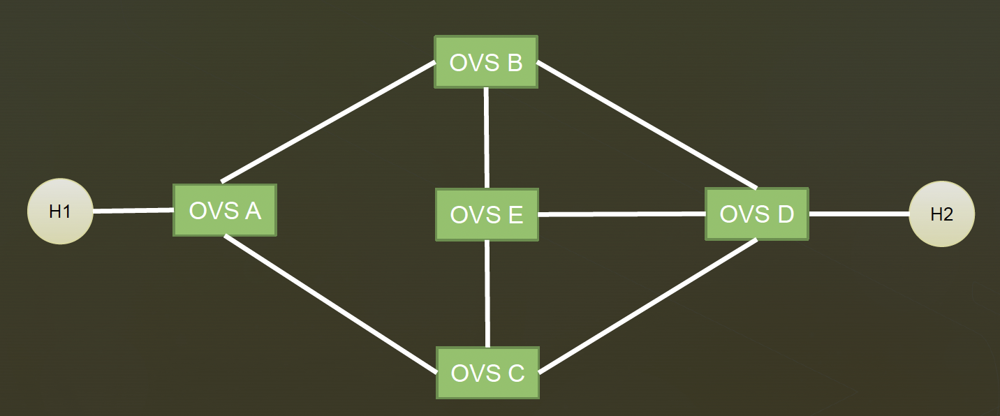
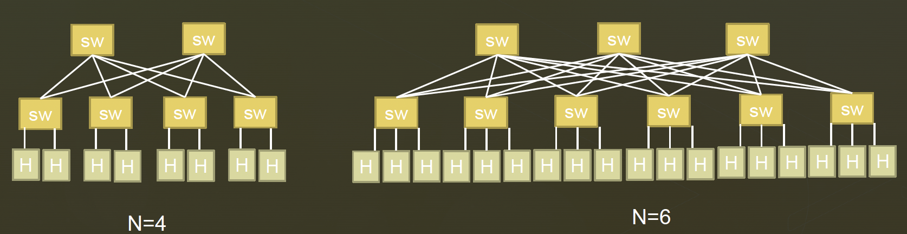

## 1. Running Mininet with Custom Topology

### - Requirement



create the topology and manually install flow entries

1. Traffic from H1 -> H2
    -  HTTP traffic with destination port=80 follows path: A-B-D
    -  other traffic follows path: A-C-E-D
2. Traffic from H2 -> H1
    - HTTP traffic with source port=80, follow path: D-C-A
    - other traffic follows path: D-B-E-C-A


### - Solution
1. topology defined in custom-mininet-topo.py 
    ```
    sudo mn -–custom custom-mininet-topo.py –-topo mytopo -–controller remote
    ```
2. add flows
    ```
    chmod +x add_flows.sh
    ./add_flows.sh
    ```


## 2. Two-Stage Fat Tree Topology

### - Requirement



create a 2-stage Fat Tree network using N-port switches


### - Solution
topology defined in custom-mininet-topo.py


## Error Handling

### Exception: Please shut down the controller which is running on port 6653

```
sudo fuser -k 6653/tcp
```